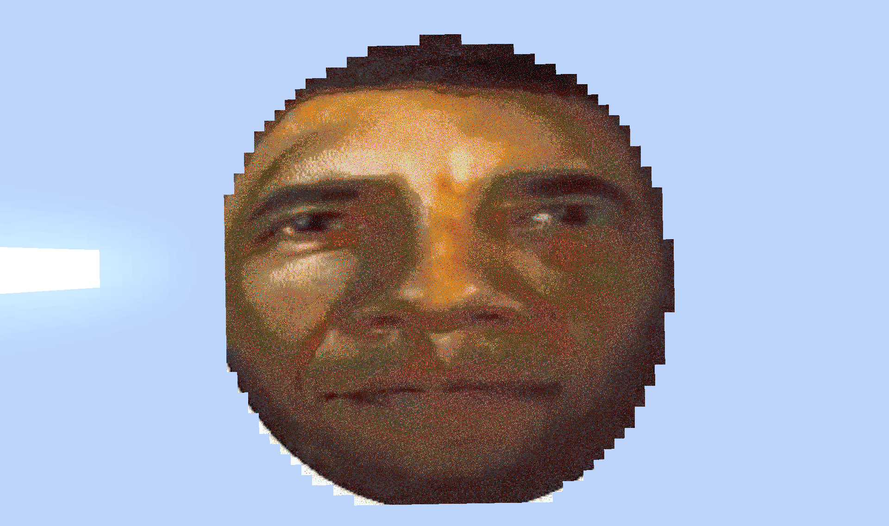

# mcimage
A robust Minecraft image converter that generates *.mcfunction files that are executed in-game (within data-packs).
Images are limited to 256 colors and are dithered, as indexed images provide major speed boosts.

For all high resolution images due to in-game restrictions, it's required to scale the image, as each pixel is translated to a block in-game.

To use this, run 'py mcim.py' from the command-line and pass a file path to it.
Optional arguments include --dest, --scale, --suppress, --orientation, and --compress.

## Pros
* [x] Robust (due to paletted images and NumPy).
* [x] Omnidirection-ability.
* [x] Support for run-length encoding that has a modest compression ratio with an okay best-case scenario (about 5/2 on most trials). This is essentially useless since Minecraft's fill command won't work in unloaded chunks in large images.
* [x] Command-line and modular support.
* [x] Dithered images.
* [ ] Force-loads chunks :(

## Cons
* [x] Scar artifacts may appear in behemoth (horizontal) images due to chunks not loading in Minecraft. This can be fixed however, by not using the compression feature.
* [x] Minecraft has a bug in it where after reloading, it won't set the `maxCommandChainLength` (how many commands can run in a single function) and you have to run it twice for it to work.
* [x] Won't place a platform for falling blocks to rest on, so don't try making a floating image! (Might be patched later)

Here is a generated example:

